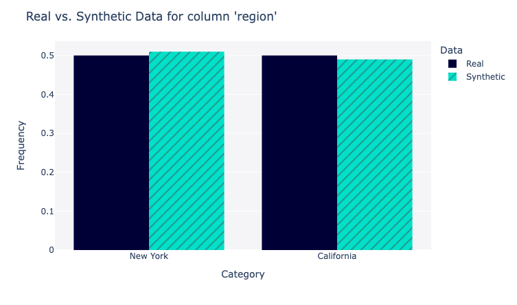

# Time Series Metrics

## Installation
Create and enter the anaconda virtual environment
```Bash
conda create --name <your_env_name> python=3.9
conda activate <your_env_name>
```

Install packages and dependencies
```
pip3 install -e .
```

## TimeSeriesMetric

The metrics found on this folder operate on individual tables which represent sequencial data.
The tables need to be passed as two `pandas.DataFrame`s alongside optional lists of
`entity_columns` and `context_columns` or a `metadata` dict which contains them.

Implemented metrics: TBD

All the timeseries metrics are subclasses form the `sdmetrics.timeseries.TimeSeriesMetric`
class, which can be used to locate all of them:

```Python
from sdmetrics.timeseries import TimeSeriesMetric
TimeSeriesMetric.get_subclasses()
```

## Time Series Inputs and Outputs

All the timeseries metrics operate on at least three inputs:

* `real_data`: A `pandas.DataFrame` with the data from the real dataset.
* `synthetic_data`: A `pandas.DataFrame` with the data from the synthetic dataset.
* `entity_columns`: A `list` indicating which columns represent entities to which
  the different senquences from the dataset belong.

For example, an `SingleAttrDistSimilarity` metric can be used on the `sunglasses` demo data as follows:

```python3
from sdmetrics.demos import load_timeseries_demo
from sdmetrics.timeseries import SingleAttrDistSimilarity

real_data, synthetic_data, metadata = load_timeseries_demo()
scores = SingleAttrDistSimilarity.compute(real_data, synthetic_data, metadata)
```

The output `scores` will contain two parts (if applicable) for each attribute/feature: (1) a numerical number (2) a visualization plot.



Example plot: distribution of `region` in the `sunglasses` demo data.


---

Additionally, all the metrics accept a `metadata` argument which must be a dict following
the Metadata JSON schema from SDV, which will be used to determine which columns are compatible
with each one of the different metrics, as well as to extract any additional information required
by the metrics, such as the `entity_columns`.

If this dictionary is not passed it will be built based on the data found in the real table,
but in this case some field types may not represent the data accurately (e.g. categorical
columns that contain only integer values will be seen as numerical), and any additional
information required by the metrics will not be populated.
